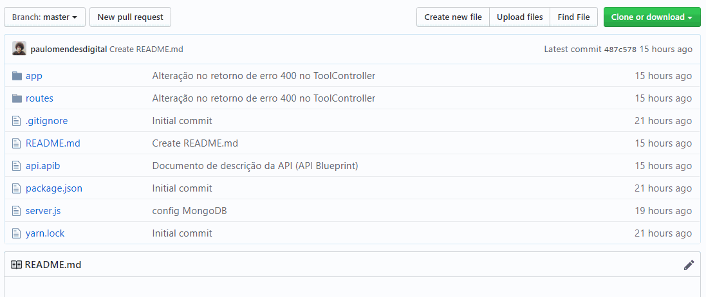
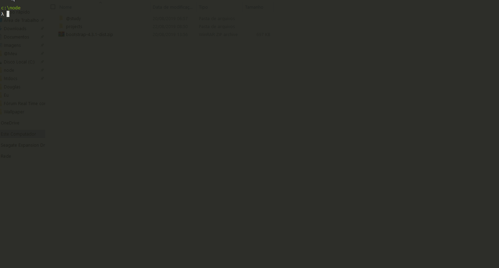
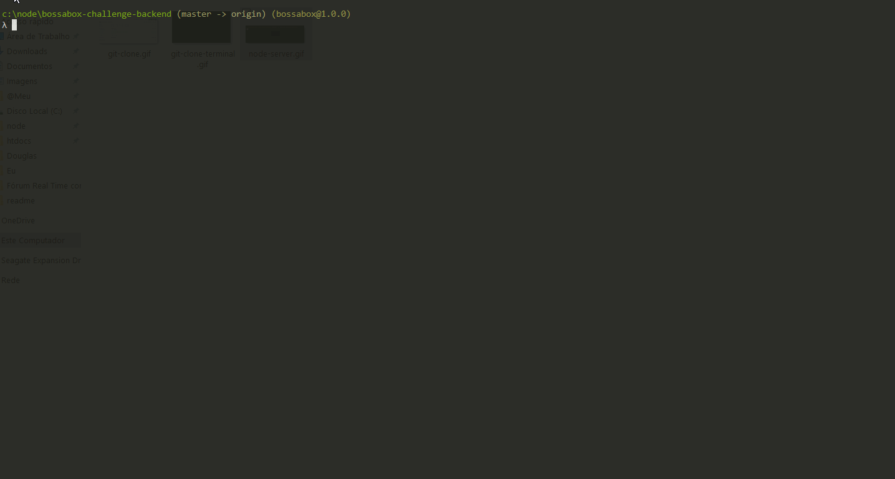
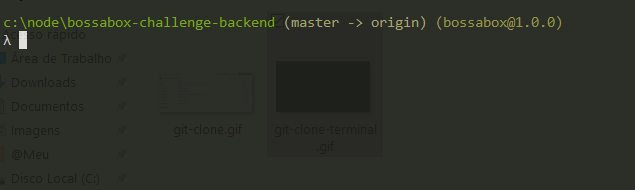
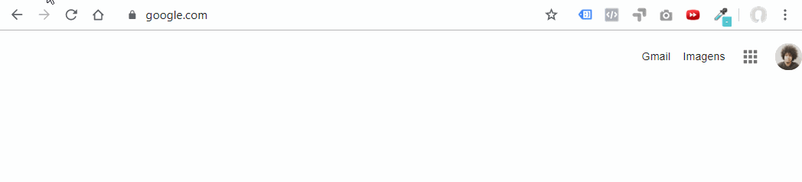
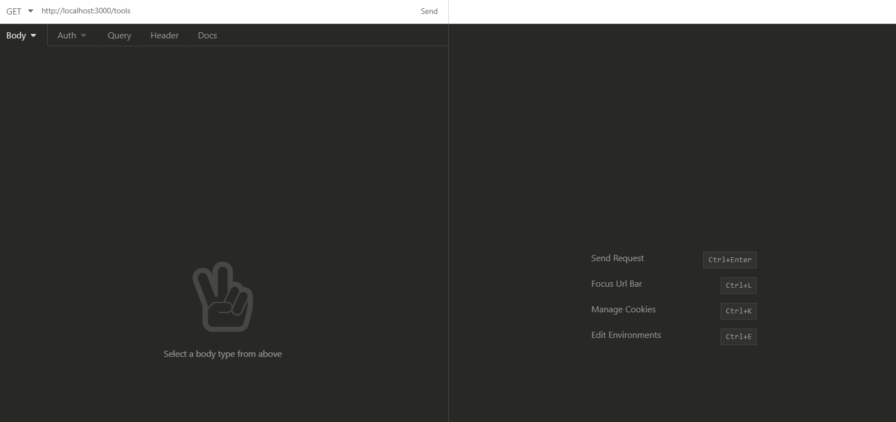

# VUTTR (Very Useful Tools to Remember)

VUTTR é repositório para gerenciar ferramentas com seus respectivos nomes, links, descrições e tags.
A linguagem utilizada para desenvolver o VUTTR foi o Node.js com banco de dados MongoDB

## Pré requisitos

- Git (https://git-scm.com/)
- Node.js (https://nodejs.org/)
- MongoDB (https://www.mongodb.com/)

## Start
- Primeiro você precisa instalar o [Node.js](https://nodejs.org/en/) no seu pc e seguir o procedimento padrão de instalação **next->next->ok**
- Instale o [MongoDB](https://www.mongodb.com/download-center/community)
- Para copiar o repositório baixe o [Git](https://git-scm.com/downloads) e instalar na sua maquina, depois basta copiar a URL do projeto conforme abaixo:



## Clonando o Repositório ##
Com o Git e o Node.js instalado na sua maquina e a **URL** do projeto em mãos, crie em algum lugar do seu pc uma pasta para criarmos uma copia do repositório, dentro dela abra o **cmd**, **powershell**, ou um terminal de sua preferência e digite os comandos abaixo:
```
git clone https://github.com/paulomendesdigital/bossabox-challenge-backend.git
cd bossabox-challenge-backend
npm install
```



## Rodando banco de dados (MongoDB)
No seu terminal de preferência execute o comando abaixo:
```
mongod
```



obs: não feche o terminal que está rodando o comando a cima (mongod)

## Rodando servidor (porta: 3000)
Agora dentro da pasta **bossabox-challenge-backend** abra um novo terminal (sem fechar o que está rodando o MongoDB - "mongod") e execute o comando:
```
node server.js
```



## Testando endpoints
- Um bom programa para testar os endpoints é o [Insomnia](https://insomnia.rest/download/)
- Endpoints
  - /tools [GET]
    - Exibe todas as ferramentas cadastradas no banco de dados
  - /tools?tag=node [GET]
    - Exibe as ferramentas que possuem a tag informada na query (ex: node)
  - /tools [POST]
    - Cadastra uma nova ferramenta com o objeto JSON informado no request
  - /tools/:id [GET]
    - Exibe a ferramenta que possui o id informado no parâmetro
  - /tools/:id [PUT]
    - Atualiza a ferramenta que possui o id informado no parâmetro, com o objeto JSON informado no request
  - /tools/:id [DELETE]
    - Deleta a ferramenta que possui o id informado no parâmetro

### Browser



### [Insomnia](https://insomnia.rest/)



[Documentação da api - API Blueprint](https://github.com/paulomendesdigital/bossabox-challenge-backend/blob/master/api.apib)
